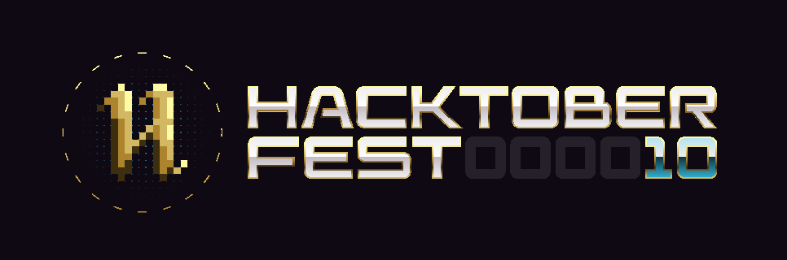
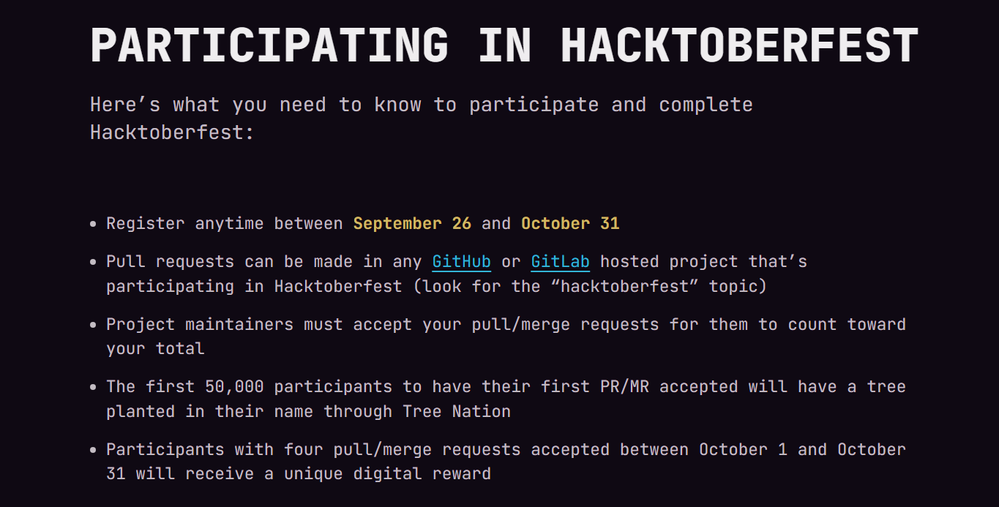

#  💛🎯   HacktoberFest 2023  💛🎯 
# Make your first Pull Request and earn a free T-shirt 👕👕 from GitHub!
#### All valid PRs will be merged or suitable tags like hacktober-accepted will be given 
#### Star & fork this Repo first 


Use this project to make your first contribution to an open source project on GitHub. Practice making your first pull request to a public repository before doing the real thing! 
This repository is open to all members of the GitHub community. Any member may contribute to this project without being a collaborator.

## What is Hacktoberfest?
A month-long celebration from October 1st - 31st sponsored by [Digital Ocean](https://hacktoberfest.digitalocean.com/) and [GitHub](https://github.com/blog/2433-celebrate-open-source-this-october-with-hacktoberfest) to get people involved in [Open Source](https://github.com/open-source). 
[Hacktoberfest Official Website](https://hacktoberfest.com/)
# How to contribute to this project
### Video tutorials:
- [Hacktoberfest Official Website](https://hacktoberfest.com/)
- [Complete Hacktoberfest Pack](https://www.youtube.com/watch?v=K5nzruz1FpA&list=PLseEp7p6EwiZgLPknY4ITJxfoo75wqxph)
- [How to Do Your First Pull Request](https://www.youtube.com/watch?v=nkuYH40cjo4)
- [Resolving Merge Conflict](https://www.youtube.com/watch?v=kBIMGOxqqnk&t=207s)

### For Beginners
1) Visit & Learn   [Tutorial Github](https://www.youtube.com/playlist?list=PL4cUxeGkcC9goXbgTDQ0n_4TBzOO0ocPR)
2) Clone this repo
3) Make a pull request
4) Wait until your pull request is merged/given accepted tag

## Enjoy , You have made it 🥳🥳🚀🚀 

## Getting started
* Fork this repository (Click the Fork button in the top right of this page, click your Profile Image)
* Clone your fork down to your local machine

```markdown
https://github.com/ossamamehmood/Hacktoberfest2023.git
```

* Create a branch

```markdown
git checkout -b branch-name
```

* Make your changes (choose from any task below)
* Commit and push

```markdown
git add .
git commit -m 'Commit message'
git push origin branch-name
```

* __Star this repository__ 
* Create a new pull request from your forked repository (Click the `New Pull Request` button located at the top of your repo)
* Wait for your PR review and merge approval!
# Tasks
### 1. Add your name
Add your name to the `Profile.md` file using the below convention:

| Name | Bio     | Github |
| :-------- | :------- | :-------------------------------- |
| Your_Name    | Coder, Develoer ..| https://github.com/username  |


### 2. Add a profile page

### [🔗] [Best Readme Generator](https://gprm.itsvg.in/)
Add a `Your_Name.md` file to the `profiles` directory. Use any combination of content and Markdown you'd like. Here is an example:
```
| Name | Location | Academics | Interests | Development |Projects |Profile Link|
```
### 3. Create a `Hello, World!` Script
Add a `hello_world_yourusername.xx` script to the `scripts` directory in any language of your choice! Here is an example:

```Javascript
// LANGUAGE: Javascript
// ENV: Node.js
// AUTHOR: Alice Chuang
// GITHUB: https://github.com/AliceWonderland

console.log('Hello, World!');
```
### 3. Add `CODE|PROJECT|SNIPPETS` 
Add a `directory` inside `Resources` directory and add whatever resources you want to share.
It may be some alogrithms, projects or snipets.

# Add sub-folders of your name and put files into respective sub-folders
#### Example - >
```
project
│   README.md
│   file001.txt    
│
└───folder1
│   └───subfolder1(your name + github id( optional ))
│       │   file111.cpp
│       │   file112.js
│       │   ...
│   
└───folder2
```




# Reference links
##### Git branching : [https://learngitbranching.js.org/]
##### Creating awesome readme Online : [https://dillinger.io/](https://dillinger.io/)
##### Managing Forked Repos: [https://help.github.com/articles/fork-a-repo/](https://help.github.com/articles/fork-a-repo/)
##### Syncing a Fork repo: [https://help.github.com/articles/syncing-a-fork/](https://help.github.com/articles/syncing-a-fork/)
##### Checkout this list for README examples - Awesome README [](https://github.com/sindresorhus/awesome)
##### Github-Flavored Markdown [https://guides.github.com/features/mastering-markdown/](https://guides.github.com/features/mastering-markdown/)


# Star this Repo first